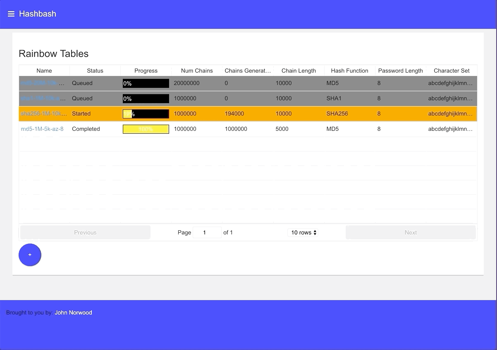

Hash Bash Backend Java
======================



From the Hashbash [homepage](https://hashbash.jmn23.com):

```
This is a web-based rainbow table generator and searcher. It is deployed on a raspberry pi cluster
running kubernetes. Visit my github to view the salt-stack configuration, build tools, and custom
docker images I've built to deploy this and other projects on this platform.

You can see this particular project at https://github.com/norwoodj/hashbash
You might also visit my other project https://stupidchess.jmn23.com

A rainbow table is a data structure that supports the space and time efficient reversal of
cryptographic hash functions. For details on how this works visit this article
https://en.wikipedia.org/wiki/Rainbow_table

This implementation uses java, spring-batch, and mysql to generate and store the rainbow table.
You can then use the API or web interface to search existing rainbow tables. This is certainly not the most
efficient implementation of rainbow tables possible or available. This was simply a fun way to implement the
algorithm in a user-friendly way.
```

I have also written a go version of this application for comparison across various performance metrics. The comparison
of the two is summarized in this [blog post](https://medium.com/@norwood.john.m/hashbash-a-comparison-of-cpu-and-io-bound-applications-in-go-and-java-across-multiple-metrics-d358df6e03b1).


### This Codebase
This code was written as a way to mess around with spring batch, which I have also used in a professional
setting at a job, and use it to generate a cool data structure that I wrote a C++ implementation
for in college. This is a slower version of that using spring boot, and a bunch of its starters for
batch, web, jpa, rabbitmq, etc. The other key thing that it dumbs down is using a mysql database and
a unique index on endpoint hashes to support efficient uniquifying and searching.

This codebase builds two applications. The first is a java web server that handles requests for information
about rainbow tables, as well as handles requests to search or generate a rainbow table by posting a message
to one of several task queues. The second application is a set of rabbitmq consumers that consume from the 
task queues and perform the compute-intensive search, generate, and delete tasks.

The main point of this is that I'm a professional software developer, and my hope is that you, dear recruiter,
see this as an indication of my skillset.

This project leverages docker and docker-compose to build and run the application locally requiring
installation of minimal requirements, and with great developer ease. The same docker images that are built
to do this can beg deployed to a remote docker image repository as well and there is helm configuration to
deploy these images to a kubernetes cluster.


### Building and Developing Locally
In order to build, run and develop this project locally you'll need a number of things installed:

* docker
* docker-compose
* make

To build the docker images
```
make
```

To run the application locally in docker:
```
make run
```

To run the application on your host machine, with rabbitmq and mysql in docker:
```
make run-deps
```

And finally, to publish the docker images to a docker registry:
```
make push
```
